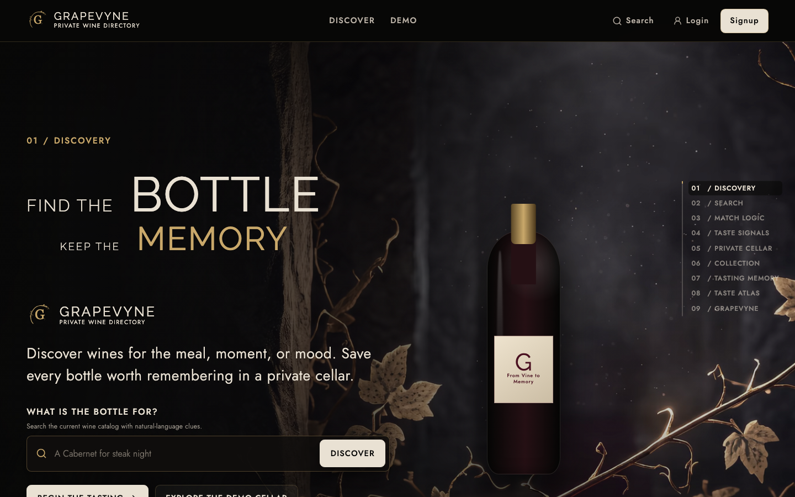
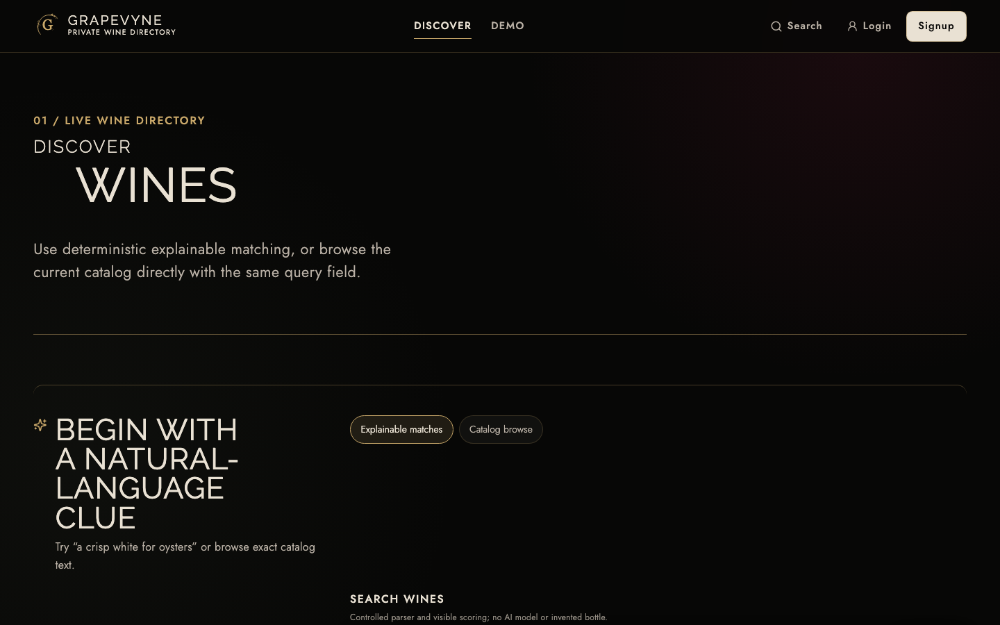
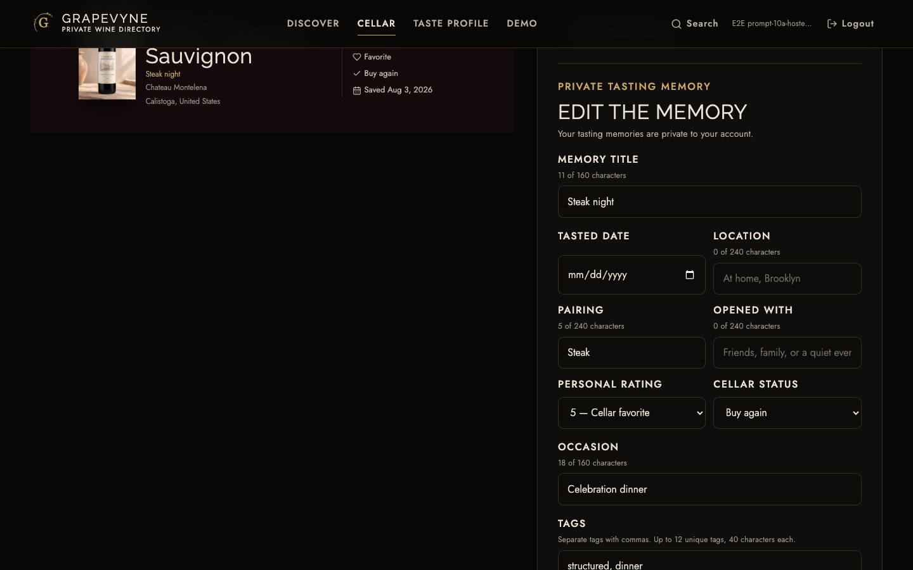
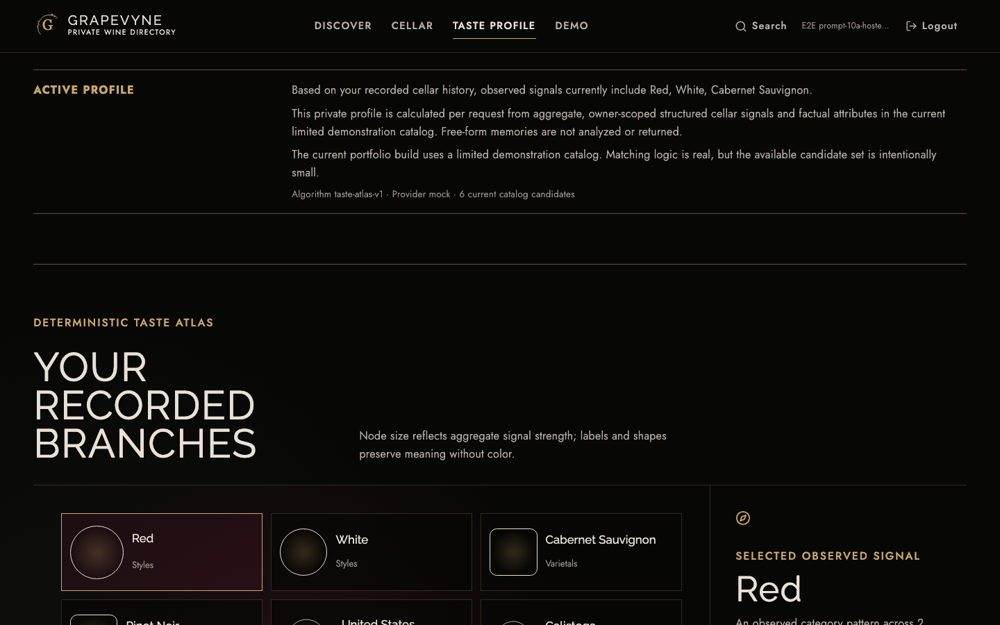

# GRAPEVYNE — From Vine to Memory

GRAPEVYNE is a cinematic wine-discovery and private-cellar product. It helps someone find a bottle for a meal, moment, or mood, understand why it matches, and keep every bottle worth remembering as a private tasting memory.

> **Verified Preview:** [open the protected GRAPEVYNE branch Preview](https://grapevyne-joshuaprevilon13-7141-joshuaprevilon13-7141s-projects.vercel.app). This is a Vercel **Preview**, not the Production URL; the project owner may need to sign in to Vercel because Deployment Protection remains enabled.



## Product

- Natural-language catalog discovery and deterministic, explainable recommendations
- Source-backed wine detail routes with match signals and pairing context
- Signed-in, owner-scoped Cellar with full create/read/update/delete behavior
- Tasting memories for the date, place, pairing, companions, notes, rating, status, favorite, and buy-again decision
- Private Taste Profile and accessible Taste Atlas with empty, limited, and active states
- Public, read-only Cellar and Taste Atlas demonstrations
- A nine-chapter “From Vine to Memory” homepage with local cinematic media
- A local WebGL bottle, high/standard model tiers, and a tested software-renderer fallback
- Responsive layouts, keyboard support, reduced motion, and readable alternatives to visual data

The current catalog contains six deliberately transparent demonstration records. It proves search, scoring, explainability, personalization, and ownership behavior; it is not represented as a comprehensive commercial wine catalog.

## Architecture

```text
Browser (one HTTPS origin)
  ├── /                 Vite 6 + React 18 + TypeScript
  ├── /build/*          content-hashed frontend bundles
  ├── /assets/*         local video, posters, models, labels, and brand assets
  └── /api/*            Flask 3 Vercel Function
                           └── dedicated PostgreSQL database
```

The browser always requests relative `/api` paths with credentials included. The hosted topology uses one Vercel project and one public origin—there is no browser-visible secondary API origin.

### Frontend

Vite, React, TypeScript, React Router, TanStack Query, GSAP, Framer Motion, Lenis, React Three Fiber, Drei, and Three.js. Route modules and the WebGL experience remain lazy-loaded, while approved media/model/label/font files are local and checksum-verified.

### Backend

Flask application factory, Flask-SQLAlchemy, Flask-Migrate/Alembic, psycopg 3, and PostgreSQL. `backend/app` remains the only backend source of truth; `api/index.py` is a thin WSGI deployment adapter and never starts a development server, migrates, or seeds on import.

### Security and privacy

- Signed Flask sessions with `HttpOnly`, `Secure` in hosted environments, and `SameSite=Lax`
- Fixed session expiry without refresh-on-read
- Exact trusted origins and credentialed CORS; no wildcard origin
- unsafe-request Origin and Fetch Metadata checks
- User identity comes only from the signed session
- Every private Cellar query is owner-scoped
- Private auth, Cellar, profile, and personalized responses use `private, no-store` and `Vary: Cookie`
- Account switching clears private frontend query state
- No free-form private memories are returned by public catalog or recommendation endpoints
- The deployment contract requires Preview and Production to use separate secrets and separate PostgreSQL resources; Prompt 10A configures Preview only

## Repository

```text
GRAPEVYNE/
  api/index.py             Vercel WSGI adapter
  backend/
    app/
      models/              SQLAlchemy models
      routes/              Flask API blueprints
      services/            search, recommendation, Cellar, and taste logic
    migrations/            reviewed Alembic history (0001 and 0002)
    tests/                 API, ownership, security, and PostgreSQL tests
  frontend/
    public/                local production media and WebGL assets
    src/
      api/                 typed same-origin client and normalizers
      components/          layout, navigation, routing, and shared UI
      experience/          scroll story, media, motion, and WebGL
      pages/               lazy route-level views
    e2e/                   Playwright journeys and quality gates
  docs/
    screenshots/           browser evidence
    v2/                    architecture, migration, quality, and release reports
  vercel.json              stable one-project Preview configuration
```

## API contract

```text
GET    /api/health

POST   /api/auth/signup
POST   /api/auth/login
POST   /api/auth/logout
GET    /api/auth/me

GET    /api/wines/search?query=steak
GET    /api/wines/recommendations?query=bold%20red%20for%20steak
GET    /api/wines/:externalWineId

GET    /api/cellar
POST   /api/cellar
GET    /api/cellar/:entryId
PATCH  /api/cellar/:entryId
DELETE /api/cellar/:entryId

GET    /api/profile/taste
```

Successful responses use a `data` envelope; errors use a single `error` envelope with a stable code and message. The frontend does not call an external wine provider directly.

## Local setup

The accepted CI baseline uses Node `20.19.6` and Python `3.12.12`. Vercel guarantees the supported Node `20.x` and Python `3.12` runtime lines and reports the actual patch versions in build logs.

### PostgreSQL and Flask

```bash
cd backend
python3.12 -m venv .venv
source .venv/bin/activate
python -m pip install -r requirements.txt -r requirements-dev.txt
cp .env.example .env
python -m flask --app app db upgrade
python -m flask --app app db current
python -m flask --app app run --debug
```

Create a local PostgreSQL database and set `DATABASE_URL` in the untracked `backend/.env`. Importing or starting the application never creates, migrates, or seeds a database. Optional local demonstration seeding remains an explicit CLI action.

### Vite and React

```bash
cd frontend
npm ci
cp .env.example .env
npm run dev
```

Vite serves `http://localhost:5173` and proxies relative `/api` requests to local Flask at `http://127.0.0.1:5000`.

## Environment-variable names

Values are never committed. Backend runtime names are:

```text
FLASK_ENV
DATABASE_URL
DEPLOYMENT_DATABASE_SENTINEL
SECRET_KEY
FRONTEND_ORIGINS
SESSION_COOKIE_NAME
SESSION_COOKIE_DOMAIN
SESSION_COOKIE_SECURE
SESSION_LIFETIME_DAYS
TRUST_PROXY_HEADERS
```

`VITE_API_BASE_URL` is an optional local frontend override; hosted browser code keeps the default relative `/api`. Vercel supplies trusted system metadata such as `VERCEL`, `VERCEL_ENV`, `VERCEL_URL`, `VERCEL_BRANCH_URL`, and `VERCEL_PROJECT_PRODUCTION_URL`. No backend secret uses a `VITE_` prefix.

Preview database migrations are explicit and use the provider’s direct/unpooled connection when supplied. Request-time application traffic uses the pooled Preview connection. Production migration and promotion are intentionally deferred to Prompt 10B.

## Quality gates

```bash
cd frontend
npm run verify:assets
npm run lint
npm run typecheck
npm test
npm run build
npm run verify:bundle
npm run test:e2e:chromium
npm run test:e2e:cross-browser
npm run test:a11y
npm run test:visual
npm run test:performance
npm audit

cd ../backend
python -m pip check
python -m compileall app tests
python -m pytest
python -m pip_audit
python -m bandit -q --severity-level medium -r app
```

GitHub Actions repeats the frontend, backend, PostgreSQL migration, Chromium, Firefox, and WebKit gates with immutable action and database-image pins. The explicit hosted mode additionally verifies that its target is a READY Vercel **Preview** before it can run.

Physical iPhone Safari, physical Mac Safari, and VoiceOver remain honest manual gates for Prompt 10B; automated WebKit and Axe coverage do not masquerade as those physical checks.

## Evidence

| Discovery | Private tasting memory | Active Taste Profile |
| --- | --- | --- |
|  |  |  |

Detailed accepted evidence is recorded in `docs/v2/quality-report.md`, the Prompt 09A release-remediation reports, and the [Prompt 10A hosted Preview report](docs/v2/10a-hosted-preview-report.md). The [manual Preview checklist](docs/v2/10a-preview-manual-review-checklist.md) keeps physical Safari and screen-reader review explicit and unclaimed. Prompt 10A does not merge the pull request or create a Production deployment.
